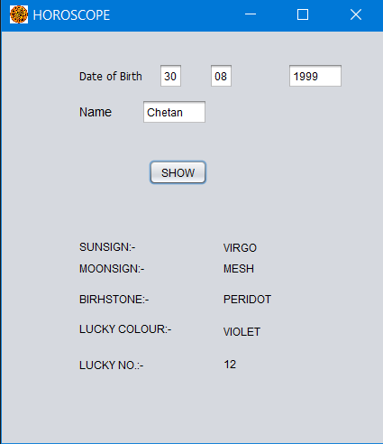

# Horoscope-Java-Application
## About
* In this application, the app will take the inputs like Name and Date of Birth from the user. 
* From this information, the application calculates and shows the user's Birthstone, Sun sign, Moon sign, lucky number, and lucky color.
* Package used - Java Swing
## Output 
</img>
## .Jar file link
